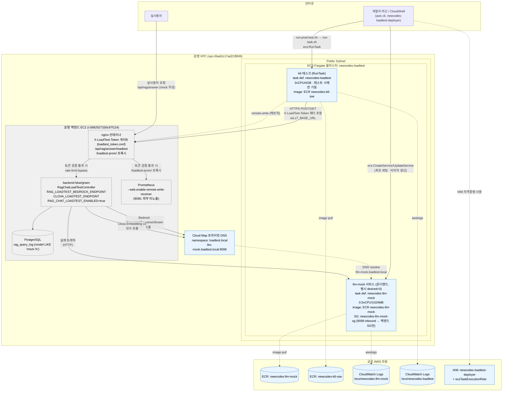

# 부하테스트 AWS 자원 정리

`load-test/fargate/MOCK_SERVICE_SETUP.md`(상시 LLM mock 세팅)와 `load-test/fargate/*.sh`(k6 실행)를 기준으로,
부하테스트를 위해 실제로 프로비저닝되는 AWS 자원과 이미 존재하던 운영 자원 중 부하테스트가 얹혀 쓰는 자원을 모두 정리한다.

> 비용은 ap-northeast-2 온디맨드 기준 **개략적 추정치**(2026-08 시점 공개 요금 기준)다. 실제 청구서는 AWS Cost Explorer로 확인할 것 — 여기 숫자는 "자릿수 감"을 잡기 위한 용도.

---

## 1. 새로 만든 자원 (부하테스트 전용)

### 1.1 ECR (Elastic Container Registry)

| 리포지토리 | 용도 |
|---|---|
| `newcodes-llm-mock` | Bedrock/Clova mock 서버 이미지 (`load-test/mock/`) |
| `newcodes-k6-sse` | k6 + xk6-sse 커스텀 빌드 이미지 (`load-test/docker/Dockerfile`) |

- **비용**: 스토리지 $0.10/GB·월 (프리티어 500MB/월 무료). 이미지 각각 수백MB 수준이라 **월 $1 미만**.
- **관리**: 코드 수정 시 `docker build` → `docker push`, mock은 이후 `aws ecs update-service --force-new-deployment`로 갱신.

### 1.2 ECS (Elastic Container Service) — Fargate, 클러스터 1개 공유

**클러스터**: `newcodes-loadtest`

| 종류 | 이름 | 실행 방식 | 스펙 | 상시 여부 |
|---|---|---|---|---|
| Service | `llm-mock` | `create-service`, desired-count **평시 0** | task def `newcodes-llm-mock` (0.5 vCPU / 1024MB) | **온디맨드** — `run-prod-test.sh`가 테스트 실행마다 1로 올렸다가 종료 후 자동으로 0으로 내림 |
| Task def (RunTask) | `newcodes-loadtest` | `run-task.sh`가 테스트 시마다 `RunTask`로 기동 | task def `newcodes-loadtest` (2 vCPU / 4096MB) | 테스트 중에만, 종료 시 자동 정지 |

- mock은 **Service**(desired-count를 원커맨드 스크립트가 토글, health check 기반 교체)로, k6는 **RunTask**(1회성 배치)로 관리 방식이 다르다.
- 둘 다 `awsvpc` 네트워크 모드, **public 서브넷 + `assignPublicIp=ENABLED`** — NAT Gateway 없이 ECR pull/CloudWatch Logs 전송을 위한 인터넷 경로만 확보하고, 실제 접근 통제는 보안그룹(mock 인바운드) + 앱 레벨 시크릿 토큰(k6 아웃바운드 요청)이 담당.
- **비용**:
  - `llm-mock`은 평시 desired-count 0이라 **미기동 시 과금 없음**. 테스트 실행 중(0.5 vCPU + 1GB)만 과금되며, 10분 테스트 1회 기준 vCPU ~0.083 vCPU-h + 메모리 ~0.167 GB-h → **실행당 1센트 미만** 수준(Fargate on-demand 기준, ap-northeast-2 vCPU $0.0466/h · 메모리 $0.0051/h 근사치). 반복 실행 빈도에 따라 누적되지만, 예전의 24시간 상시 기동(월 $10~12) 대비 압도적으로 저렴하다.
  - `newcodes-loadtest`(k6) task도 테스트 실행 시간만 과금 (2 vCPU + 4GB, 10분 실행 1회 ≈ $0.02 수준) — 반복 실행해도 테스트 안 돌릴 때는 $0.
- **관리**: `aws ecs describe-services --cluster newcodes-loadtest --services llm-mock`로 기동 상태 확인, 로그는 `aws logs tail /ecs/newcodes-llm-mock --follow` / `/ecs/newcodes-loadtest --follow`.

### 1.3 Cloud Map (AWS Service Discovery) — 프라이빗 DNS

- 네임스페이스: `loadtest.local` (private DNS, **운영 백엔드 EC2와 같은 VPC**에 연결)
- 서비스: `llm-mock` → A 레코드, TTL 10s
- 고정 엔드포인트: `http://llm-mock.loadtest.local:9099`
- 내부적으로 **Route 53 프라이빗 호스팅존**을 하나 만든다 (Cloud Map이 자동 생성).
- **비용**: 프라이빗 호스팅존 $0.10/존·월 + 쿼리 $0.40/백만 건 — 내부 트래픽만이라 **월 $1 미만**.
- **관리**: 새 셸 세션에서 `$SD_SERVICE_ARN`을 잃어버려도 `servicediscovery list-services`로 재조회 가능(문서 6번 참고). 별도 갱신 불필요 — task가 재기동되면 A 레코드가 자동 갱신됨(TTL 10s로 짧게 잡아둠).

### 1.4 EC2 보안그룹

| 이름 | 용도 |
|---|---|
| `newcodes-llm-mock-sg` | mock task 인바운드 — **운영 백엔드 SG로부터의 9099만 허용**, 아웃바운드는 기본 all(ECR/Logs용) |
| (`LT_SG`, k6용) | k6 task용 — 아웃바운드 443/80이면 충분, 인바운드 불필요 |

- **비용**: 무료.
- **관리**: mock SG 인바운드 source는 "운영 백엔드가 실제로 쓰는 SG"여야 함(default SG 금지) — VPC가 다르면 `InvalidGroup.NotFound` 발생(문서 5번 트러블슈팅 참고).

### 1.5 IAM

| 자원 | 용도 |
|---|---|
| 정책 `NewCodesLoadTestSetup` | ECR/ECS/Cloud Map/보안그룹 관리 + `ecsTaskExecutionRole`로의 `PassRole`만 허용 (IAM 사용자/역할 생성 권한은 의도적으로 제외) |
| 사용자 `newcodes-loadtest-deployer` | 위 정책을 부착한 프로그래밍 방식 액세스 전용 사용자 — 이 문서의 모든 CLI 명령을 이 사용자로 실행 |
| 역할 `ecsTaskExecutionRole` | ECS 태스크가 ECR pull/CloudWatch Logs 쓰기에 사용하는 표준 실행 역할(AWS 관리형 정책 `AmazonECSTaskExecutionRolePolicy`) — ECS를 이미 쓰고 있었다면 신규 생성 아닐 수 있음 |

- **비용**: 무료.
- **관리**: 루트/admin 계정 액세스 키는 최초 세팅(정책·사용자·역할 생성)에만 사용하고 이후는 `newcodes-loadtest-deployer` 액세스 키로 전환. 액세스 키는 콘솔에서 생성 시 1회만 노출되므로 CSV 다운로드 시점에 안전한 곳에 보관.

### 1.6 CloudWatch Logs

| 로그 그룹 | 소스 |
|---|---|
| `/ecs/newcodes-llm-mock` | mock 서비스 (상시) |
| `/ecs/newcodes-loadtest` | k6 태스크 (테스트 시마다) |

- **비용**: 수집 ~$0.57/GB + 저장 $0.03/GB·월 — mock/k6 로그량이 적으면 **월 $1~2 수준**. 보존 기간(retention)을 별도로 안 걸면 무기한 쌓이므로 늘어나면 retention policy를 걸어두는 게 좋음(현재 태스크 정의에 미설정).
- **관리**: `aws logs tail <그룹> --follow`로 실시간 확인.

---

## 2. 이미 있던 운영 자원 중 부하테스트가 얹혀 쓰는 것 (신규 생성 아님)

| 자원 | 역할 |
|---|---|
| **운영 VPC** (`vpc-0ba62c17ad21f8f49`) | mock/k6 Fargate task가 여기 public 서브넷에 뜸 — Cloud Map 프라이빗 DNS 해석을 위해 필수 |
| **운영 백엔드 EC2** (`i-0992927330c97f124`) | `docker-compose`로 nginx/backend(blue-green)/Prometheus 구동. `RAG_LOADTEST_BEDROCK_ENDPOINT`/`CLOVA_LOADTEST_ENDPOINT`로 mock을 호출, `RAG_CHAT_LOADTEST_ENABLED`/`RAG_CHAT_LOADTEST_BYPASS_TOKEN`으로 게이트 |
| **nginx 컨테이너** (EC2 내 `newcodes-nginx`) | `X-LoadTest-Token` 헤더로 `/api/rag/answer/loadtest`, `/loadtest-prom/` 접근 게이트 + rate limit bypass. `nginx/loadtest_token.conf`(git 미추적) 볼륨 마운트 |
| **Prometheus 컨테이너** (EC2 내, docker-compose) | `--web.enable-remote-write-receiver`로 k6 결과 수신. 9090을 인터넷에 직접 열지 않고 nginx `/loadtest-prom/` 프록시 경유 |
| **운영 백엔드 보안그룹** (`sg-002078560e9771f7c`) | mock SG의 인바운드 허용 source(운영 백엔드만 mock 호출 가능하도록) |

이 자원들은 부하테스트 때문에 새로 만든 게 아니라, 운영 서비스 자체 자원에 부하테스트용 설정(env, nginx location, docker-compose volume)만 얹은 것 — 그래서 위 1번 표의 "신규 자원"에서 제외했다.

---

## 3. 비용 요약

| 항목 | 성격 | 월 추정 비용 |
|---|---|---|
| ECS Fargate `llm-mock` 서비스 (온디맨드) | 종량 (테스트 실행 시에만) | 실행당 1센트 미만, 평시 $0 |
| Cloud Map 프라이빗 호스팅존 | 고정 | ~$0.1 + 쿼리량 |
| CloudWatch Logs | 변동 (로그량 비례) | ~$1~2 |
| ECR 스토리지 | 변동 (이미지 크기 비례) | <$1 |
| k6 RunTask (테스트 실행 시에만) | 종량 (실행할 때만) | 실행당 수 센트 |
| 운영 EC2/nginx/Prometheus | 이미 존재하는 운영비, 증분 없음 | $0 (증분 기준) |

**mock ECS 서비스는 평시 desired-count 0(미기동)이 기본**이라 상시 지속 비용이 사실상 없다 — `run-prod-test.sh`가 테스트 실행마다 desired-count를 1로 올렸다가 종료 후 자동으로 0으로 되돌린다(이 실행이 직접 올린 경우에만; 이미 떠 있었다면 건드리지 않는다). 테스트를 안 도는 동안은 mock endpoint가 꺼져 있는 게 정상 상태이며, 이 상태에서 mock 경로로 실수로 요청이 들어와도 앱이 503으로 fail-safe 된다. 수동으로 `aws ecs update-service --cluster newcodes-loadtest --service llm-mock --desired-count 1`로 올려둔 채 깜빡 잊은 경우를 대비해 가끔 `aws ecs describe-services ... --query 'services[0].desiredCount'`로 확인해두면 좋다.

---

## 4. 관리 체크리스트

- **mock 이미지 갱신**: `docker build/push` → 평시(desired-count 0)라면 다음 테스트 실행 시 자동으로 최신 이미지가 반영됨, 테스트 도중 갱신할 때만 `aws ecs update-service --force-new-deployment` 필요
- **토큰 로테이션**: `nginx/loadtest_token.conf`(운영 서버) + 운영 `.env`의 `RAG_CHAT_LOADTEST_BYPASS_TOKEN` + `load-test/fargate/env`의 `LT_BYPASS_TOKEN` — 3곳을 반드시 같은 값으로 동시 교체
- **상태 확인**: `aws ecs describe-services --cluster newcodes-loadtest --services llm-mock --query 'services[0].{desired:desiredCount,running:runningCount}'` — 평시엔 `desired:0, running:0`이 정상
- **테스트 후 정리**: mock 서비스는 `run-prod-test.sh`가 종료 시 자동으로 desired-count 0으로 내리므로(이 실행이 직접 올린 경우) 원복 불필요. 게이트/nginx bypass는 상시 유지라 그대로 둔다. 남는 건 로그뿐 — `DELETE FROM rag_query_log WHERE model LIKE 'mock.%';`
- **보안 원칙**: mock 노출면은 보안그룹(운영 백엔드 SG만 인바운드 허용) + 앱 게이트(mock endpoint 비면 503) + 평시 미기동(desired-count 0) + 로그 격리(`model LIKE 'mock.%'`) 4중 — 토큰 자체가 뚫려도 실제 LLM 과금 유출로 이어지진 않도록 설계됨

---

## 5. 전체 아키텍처



**흐름 요약**

1. 개발자가 `run-prod-test.sh`(mock 헬스체크 후) → `run-task.sh`로 ECS `RunTask`를 호출해 k6 태스크를 기동한다.
2. k6 태스크는 `https://newcodes.net`(운영 nginx)에 `X-LoadTest-Token` 헤더를 실어 요청을 보낸다.
3. nginx는 토큰을 `loadtest_token.conf`와 대조해 통과시키고(rate limit bypass), 요청을 백엔드(blue/green)로 전달한다.
4. RAG 채팅 mock 경로(`/api/rag/answer/loadtest`)로 들어온 요청은 백엔드가 `RAG_LOADTEST_BEDROCK_ENDPOINT`/`CLOVA_LOADTEST_ENDPOINT`(Cloud Map이 해석하는 `llm-mock.loadtest.local:9099`)로 mock 서비스를 호출한다 — 실제 Bedrock/Clova는 전혀 타지 않는다.
5. mock 서비스는 평시 desired-count 0인 온디맨드 ECS 서비스로, `run-prod-test.sh`가 테스트 실행마다 기동시킨다. 실측 Prometheus 지표로 캘리브레이션된 지연 분포로 Bedrock eventstream/Clova 응답을 흉내낸다.
6. k6 결과는 nginx `/loadtest-prom/` 프록시(같은 토큰으로 게이트)를 거쳐 운영 Prometheus로 remote-write되고, Grafana에서 `testid` 라벨로 조회한다.
7. mock 경유 요청은 `rag_query_log.model LIKE 'mock.%'`로 격리 기록되어 실사용자 데이터와 섞이지 않는다.

---

## 6. 완전 종료(디커미션) 시 정리 절차

mock ECS 서비스는 이제 평시 desired-count 0(온디맨드)이 기본이라 상시 과금이 사실상 없으므로, **일시 중단**을 위해 따로 할 일은 없다. 아래 전체 삭제 절차는 부하테스트를 당분간 다시 안 할 것이 확실해졌을 때(단순히 "이번 주는 안 함" 수준이 아니라 프로젝트 자체를 접는 경우)만 진행한다 — Cloud Map/ECR/CloudWatch Logs 등 나머지 자원(합쳐서 월 $2~3 수준)까지 완전히 걷어낼 때만 의미가 있다.

> 순서가 중요하다: ECS 서비스/태스크가 먼저 내려가서 ENI가 해제돼야 보안그룹을 지울 수 있고, Cloud Map은 서비스를 먼저 지워야 네임스페이스를 지울 수 있다. 역순으로 하면 `DependencyViolation`/`ResourceInUse` 류 에러가 난다.

### 6.1 ECS 서비스·클러스터 (가장 먼저, 가장 큰 비용원)

```bash
REGION=ap-northeast-2

# 1) mock 서비스 축소 후 삭제 (실행 중 태스크가 있으면 --force 필요)
aws ecs update-service --cluster newcodes-loadtest --service llm-mock --desired-count 0 --region "$REGION"
aws ecs wait services-stable --cluster newcodes-loadtest --services llm-mock --region "$REGION"
aws ecs delete-service --cluster newcodes-loadtest --service llm-mock --region "$REGION"

# 2) k6 RunTask가 실행 중이라면 먼저 정지 (보통은 테스트 끝나면 자동 종료돼 있음)
aws ecs list-tasks --cluster newcodes-loadtest --region "$REGION"
# 남은 게 있으면: aws ecs stop-task --cluster newcodes-loadtest --task <TASK_ARN> --region "$REGION"

# 3) 클러스터 삭제 (서비스/태스크가 완전히 비어야 삭제됨)
aws ecs delete-cluster --cluster newcodes-loadtest --region "$REGION"
```

태스크 정의(`newcodes-llm-mock`, `newcodes-loadtest`) 자체는 등록만 해두면 과금이 없어서 안 지워도 무방하지만, 완전히 정리하려면:

```bash
aws ecs list-task-definitions --family-prefix newcodes-llm-mock --region "$REGION"
aws ecs deregister-task-definition --task-definition newcodes-llm-mock:<REVISION> --region "$REGION"
aws ecs list-task-definitions --family-prefix newcodes-loadtest --region "$REGION"
aws ecs deregister-task-definition --task-definition newcodes-loadtest:<REVISION> --region "$REGION"
```

### 6.2 Cloud Map (프라이빗 DNS) — Route53 프라이빗 호스팅존 과금 제거

```bash
NS_ID=$(aws servicediscovery list-namespaces --region "$REGION" \
  --query "Namespaces[?Name=='loadtest.local'].Id" --output text)

SD_SERVICE_ID=$(aws servicediscovery list-services --region "$REGION" \
  --filters "Name=NAMESPACE_ID,Values=$NS_ID,Condition=EQ" \
  --query "Services[?Name=='llm-mock'].Id" --output text)

# 서비스를 먼저 삭제해야 네임스페이스 삭제가 됨
aws servicediscovery delete-service --id "$SD_SERVICE_ID" --region "$REGION"
aws servicediscovery delete-namespace --id "$NS_ID" --region "$REGION"
```

### 6.3 보안그룹 (ECS 서비스 삭제로 ENI가 다 해제된 뒤에)

```bash
MOCK_SG=$(aws ec2 describe-security-groups --region "$REGION" \
  --filters "Name=group-name,Values=newcodes-llm-mock-sg" \
  --query 'SecurityGroups[0].GroupId' --output text)
aws ec2 delete-security-group --group-id "$MOCK_SG" --region "$REGION"
```

`LT_SG`(k6용 보안그룹)는 이름을 직접 붙였다면 같은 방식으로 삭제. 다만 다른 용도로 만든 범용 보안그룹을 재사용했다면(예: 기존 아웃바운드 전용 SG) 지우지 말 것 — 삭제 전 `describe-security-groups`로 다른 ENI/서비스가 참조 중인지 확인.

### 6.4 ECR 리포지토리

```bash
aws ecr delete-repository --repository-name newcodes-llm-mock --force --region "$REGION"
aws ecr delete-repository --repository-name newcodes-k6-sse --force --region "$REGION"
```

`--force`는 이미지가 남아 있어도 리포지토리째 삭제(빈 리포지토리로 만들고 싶을 뿐이면 `ecr batch-delete-image`로 이미지만 지우고 리포지토리는 남겨도 됨).

### 6.5 CloudWatch 로그 그룹

```bash
aws logs delete-log-group --log-group-name /ecs/newcodes-llm-mock --region "$REGION"
aws logs delete-log-group --log-group-name /ecs/newcodes-loadtest --region "$REGION"
```

### 6.6 IAM (비용은 없지만 보안 위생상 정리 권장)

```bash
ACCESS_KEY_ID=$(aws iam list-access-keys --user-name newcodes-loadtest-deployer \
  --query 'AccessKeyMetadata[0].AccessKeyId' --output text)
aws iam delete-access-key --user-name newcodes-loadtest-deployer --access-key-id "$ACCESS_KEY_ID"
aws iam detach-user-policy --user-name newcodes-loadtest-deployer \
  --policy-arn arn:aws:iam::<ACCOUNT_ID>:policy/NewCodesLoadTestSetup
aws iam delete-user --user-name newcodes-loadtest-deployer
aws iam delete-policy --policy-arn arn:aws:iam::<ACCOUNT_ID>:policy/NewCodesLoadTestSetup
```

`ecsTaskExecutionRole`은 **지우지 말 것** — ECS 표준 관례상 이름을 공유하는 역할이라 이 계정에 다른 ECS 워크로드가 있다면 그것들도 이 역할을 쓰고 있을 수 있다. 부하테스트 전용으로 새로 만든 게 확실할 때만(문서 -1번 참고, 계정에 ECS를 이 프로젝트 이전에 전혀 안 써봤을 때) 지운다.

### 6.7 운영 서버(EC2) 쪽 — AWS 과금 대상은 아니지만 게이트를 완전히 닫으려면 같이 정리

mock ECS를 지워도 nginx의 `/api/rag/answer/loadtest` bypass 자체는 코드에 남아 있으므로, 완전히 닫으려면:

- 운영 `.env`에서 `RAG_CHAT_LOADTEST_ENABLED`, `RAG_CHAT_LOADTEST_BYPASS_TOKEN`, `RAG_LOADTEST_BEDROCK_ENDPOINT`, `CLOVA_LOADTEST_ENDPOINT` 제거
- 운영 서버의 `nginx/loadtest_token.conf` 삭제
- `nginx/default.conf`·`docker-compose.yml`의 loadtest 관련 location/볼륨 마운트를 코드에서 제거하고 배포(이 파일들은 git 추적 대상이라 정식 PR로 반영) → 배포 후 `docker compose up -d nginx`로 재생성
- `load-test/fargate/env`(로컬, git 미추적, AWS 자원 아님)도 정리해두면 재세팅 실수를 막을 수 있음

이 6.7은 AWS 비용과 무관하지만, mock 인프라를 지운 뒤에도 토큰만 알면 찌를 수 있는 죽은 엔드포인트를 남기지 않기 위한 보안 마무리 단계다.

### 재개하려면

위 절차를 전부 실행했다면 재개 시 `load-test/fargate/MOCK_SERVICE_SETUP.md`를 처음부터(IAM 사용자 재생성부터) 다시 따라야 한다 — 부분 정리(4번 체크리스트의 `desired-count 0`)와 달리 완전 삭제는 원상복구가 아니라 재프로비저닝이다.

---

## 7. 자원 선택 이유 & 개념 학습 노트

"왜 하필 이 조합인가"와, 각 AWS 요소가 일반적으로 어떤 문제를 푸는 도구인지 정리한다. `load-test/README.md`의 "LLM Mock 모드" 섹션이 이 아키텍처를 고른 배경(트레이드오프 포함)을 다루는데, 여기서는 그 아래 깔린 AWS 개념 자체를 조금 더 풀어서 설명한다.

### 7.1 왜 EC2를 직접 띄우지 않고 ECS Fargate인가

- EC2를 하나 띄워 k6/mock을 직접 돌리는 방식의 문제: 인스턴스는 안 쓸 때도 시간 단위로 과금되고, OS 패치·용량(CPU/메모리) 계획·오토스케일링을 전부 직접 관리해야 한다.
- **Fargate = 서버리스 컨테이너**: vCPU/메모리 스펙만 태스크 정의에 적어두면 AWS가 실제 물리 서버 배치를 알아서 처리한다. 사용자는 EC2 인스턴스 타입을 고르거나 클러스터 용량을 채워 넣을 필요가 없다(대비되는 게 "ECS on EC2" 시작 유형 — 그건 사용자가 직접 EC2 오토스케일링 그룹을 클러스터 용량으로 등록해야 함).
- 이 프로젝트에 맞는 이유: k6 부하는 "가끔, 짧게" 실행되므로 상시 서버가 필요 없고 **태스크 단위 초 과금**이 정확히 맞아떨어진다. mock은 상시지만 스펙이 작아서(0.25 vCPU) EC2 인스턴스 하나를 통째로 예약하는 것보다 Fargate 쪽이 더 싸다.
- **Lambda를 안 쓴 이유**: k6는 최대 1시간짜리 soak 테스트(`soak.js`)를 포함해 Lambda의 15분 실행 제한을 넘고, 커스텀 바이너리(xk6-sse 빌드)가 필요해 컨테이너가 자연스럽다. mock도 SSE 스트리밍 응답을 유지해야 해서 Lambda의 "요청 받고 한 번에 응답" 모델과 안 맞는다.

### 7.2 ECS Service vs RunTask — 왜 mock은 Service, k6는 RunTask인가

- **Service**: "desired-count만큼 태스크가 항상 떠 있어야 한다"는 선언적 상태를 ECS가 계속 감시·재조정한다. 태스크가 죽으면 자동으로 새로 기동(self-healing). 상시 대기해야 하는 mock에 맞는 모델.
- **RunTask**: "지금 한 번 실행하고 끝나면 그만"인 배치 실행. k6는 정해진 duration만 돌고 종료되는 게 목적이라, Service로 만들면 끝난 태스크를 자꾸 재기동하려 들어 오히려 부적절하다.
- Kubernetes에 빗대면 Service(Deployment)와 Job의 차이에 대응하는 ECS의 기본 구분이다.

### 7.3 ECR — 왜 Docker Hub가 아니라 프라이빗 레지스트리인가

- 별도 레지스트리 계정/로그인 없이 **IAM 자격증명만으로 push/pull 인증**이 된다 (`aws ecr get-login-password`).
- 태스크 정의가 이미지 URI를 그대로 참조하는 게 ECS/EKS 어디서나 통하는 표준 패턴 — Docker Hub의 익명 pull rate limit 문제도 없다.
- VPC 안에서 인터페이스 엔드포인트로 pull하면 더 빠르고 폐쇄망에서도 동작 가능하지만, 이 프로젝트는 public 서브넷이라 그 이점까지는 안 씀(참고 지식으로만).

### 7.4 Cloud Map — 왜 고정 IP나 로드밸런서 대신 프라이빗 DNS인가

- Fargate 태스크는 재기동될 때마다 ENI가 새로 생성돼 **IP가 매번 바뀐다** — 고정 IP를 원하면 ENI를 별도로 관리하거나 앞단에 로드밸런서(ALB/NLB)를 둬야 하는데, mock은 트래픽이 사실상 백엔드 하나뿐인 내부 전용 단일 인스턴스라 로드밸런서까지는 과한 설계다.
- Cloud Map은 ECS 서비스와 통합돼 태스크가 뜰 때마다 A 레코드를 자동 갱신한다 — 이게 "서비스 디스커버리" 패턴의 전형적 구현이고, Kubernetes 내부 DNS(`*.svc.cluster.local`)가 클러스터 안에서 하는 역할을 VPC 레벨에서 제공한다고 보면 된다.
- 대안이었을 ALB 대비 비용/설정 단순함이 크다 — ALB는 시간당 고정비 + LCU(처리량 기반) 과금이 있어 상시 유지 비용이 Cloud Map(프라이빗 호스팅존 $0.1/월)보다 훨씬 크다.

### 7.5 보안그룹 — 왜 IP 대신 SG-to-SG 참조인가

- 이 아키텍처엔 두 가지 다른 상황이 섞여 있다: (a) k6 → nginx처럼 **소스 쪽 IP가 매번 바뀌어 IP allowlist 자체가 성립 안 하는 경우**(→ 토큰으로 대체), (b) 운영 백엔드 → mock처럼 **소스가 고정된 EC2라 IP 대신 보안그룹으로 지정 가능한 경우**.
- `--source-group`으로 보안그룹을 참조하면, 그 보안그룹에 속한 자원이 몇 개든 IP가 바뀌든 규칙을 다시 쓸 필요가 없다 — IP 대신 "신원(보안그룹 소속)"으로 신뢰하는 AWS의 표준 패턴. 단 **같은 VPC 안에서만** 동작한다는 제약이 있고, 이 문서 위쪽(SETUP.md 트러블슈팅)에서 실제로 이 제약 때문에 에러가 난 사례가 나온다.
- 보안그룹은 **stateful**이다 — 인바운드를 허용하면 그에 대한 응답 트래픽은 아웃바운드 규칙 없이도 자동 허용된다(NACL은 반대로 stateless라 양방향을 각각 명시해야 함). 그래서 mock SG는 인바운드 9099 규칙 하나만 있고 아웃바운드는 기본값(all)을 거의 그대로 둬도 문제가 없다.

### 7.6 IAM — 왜 admin 계정을 그대로 안 쓰고 전용 사용자+정책을 만드는가

- **최소 권한 원칙(least privilege)**: `NewCodesLoadTestSetup` 정책은 ECR/ECS/Cloud Map/보안그룹 관리와 `ecsTaskExecutionRole`로의 `PassRole`만 허용하고, IAM 사용자/역할을 새로 만드는 권한은 의도적으로 뺐다 — 이 자격증명이 유출돼도 공격자가 새 IAM 사용자를 만들어 권한을 상승시키는 경로(권한 에스컬레이션)를 막는 설계다.
- **`PassRole`은 자주 오해되는 권한**이다 — "이 역할 자체를 가진다"가 아니라 "이 역할을 다른 AWS 서비스에게 넘겨줄 수 있다"는 뜻. 여기서는 ECS 태스크 실행 시 `ecsTaskExecutionRole`을 그 태스크에 붙이는 것만 허용하고, 조건(`iam:PassedToService=ecs-tasks.amazonaws.com`)으로 ECS 이외의 서비스에는 못 넘기게 제한했다.
- **Execution Role vs Task Role**(이 프로젝트는 Execution Role만 씀): Execution Role은 ECS 에이전트가 이미지를 pull하고 로그를 전송하기 위해 쓰는 권한이고, Task Role은 컨테이너 **안의 애플리케이션 코드**가 AWS API를 호출할 때 쓰는 권한이다. mock/k6 컨테이너 코드 자체는 AWS API를 호출하지 않으므로 Task Role이 따로 없어도 된다.

### 7.7 CloudWatch Logs — 왜 별도 로그 수집기를 안 붙였는가

- ECS의 `awslogs` 로그 드라이버는 태스크 정의에 로그 그룹/스트림 이름만 지정하면 컨테이너의 stdout/stderr를 자동으로 CloudWatch로 전송한다 — Fluentd/Fluent Bit 같은 사이드카를 따로 붙일 필요가 없는 가장 낮은 진입장벽의 로깅 방법.
- `awslogs-create-group: true`로 로그 그룹을 미리 만들어두지 않아도 첫 태스크 실행 시 자동 생성된다 — IAM 정책에 `logs:CreateLogGroup`을 포함시켜둔 이유가 이거다.

### 7.8 NAT Gateway를 안 쓴 이유 (비용 학습 포인트)

- NAT Gateway는 프라이빗 서브넷에서 아웃바운드 인터넷 경로를 열어주는 관리형 자원인데, **시간당 고정 요금 + 처리 데이터량당 요금**이 붙어 상시 켜두면 이 부하테스트 인프라 전체 비용보다 NAT 하나가 더 비쌀 수 있다(월 대략 $30~40 이상, 데이터 처리량에 따라 더 늘어남).
- 그래서 이 프로젝트는 **public 서브넷 + `assignPublicIp=ENABLED`**로 대신했다 — ECR pull/로그 전송에 필요한 아웃바운드 인터넷 경로만 있으면 되고, 인바운드 노출은 보안그룹이 막으므로 NAT 없이도 안전하다.
- 트레이드오프: public IP가 태스크마다 임의로 배정돼 **IP allowlist를 쓸 수 없게 된 것**이 이 설계의 대가다(그래서 7.9의 토큰 기반 인증으로 우회). "NAT 비용 절감"과 "IP 기반 접근 통제 포기"가 세트로 딸려오는 선택임을 이해하는 게 중요하다.

### 7.9 시크릿 헤더 vs mTLS/IP allowlist — 위협 모델에 맞는 보안 고르기

- 가장 견고한 방법은 mTLS(상호 TLS 인증서)나 VPC PrivateLink겠지만, 이 정도 규모(사내 부하테스트 도구, 공격 표면이 크지 않음)에는 그 구현·운영 비용이 과하다. 대신 `X-LoadTest-Token` 헤더 + nginx `map` 지시자로 "우연히 맞힐 확률이 사실상 0인 비밀값"을 요구하는 정도로 충분하다고 판단한 것.
- 이건 "이론상 완벽한 보안"보다 **"실제 위협 모델에 맞는 보안"**을 고르는 예시다 — 토큰이 뚫려도 실제로 새는 건 mock 응답뿐이고, 진짜 LLM 과금 호출로는 못 새도록 이중 안전장치(mock endpoint 미설정 시 503 fail-safe, `rag_query_log.model LIKE 'mock.%'` 격리)를 따로 둔 것도 같은 맥락 — 토큰 하나에 모든 방어를 의존하지 않는 심층 방어(defense in depth) 설계.
